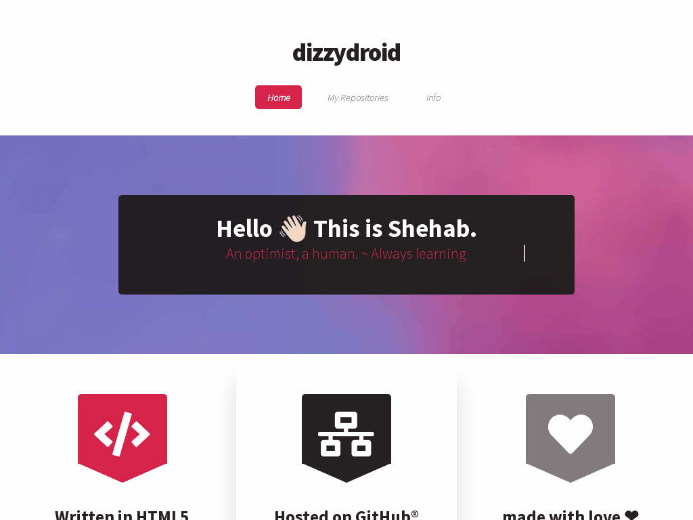

# dizzydroid's Website
> A website where I share stuff..

> https://dizzydroid.github.io/

### Website Preview 🖥

 
  <kbd>
    
  </kbd>

## Features 📋
⚡️ Fully Responsive on all devices\
⚡️ Using HTML5 & CSS3\
⚡️ Modern, welcoming design\
⚡️ Continuously updated with blogs

## Contributing 💡
#### Step 1

- **Option 1**
    - 🍴 Fork this repo!

- **Option 2**
    - 👯 Clone this repo to your local machine.

#### Step 2

- **Build your code** 🔨🔨🔨

#### Step 3

- 🔃 Create a new pull request.
___________________________________________

## License 📄

 
See the [LICENSE.txt](./LICENSE) file for details. 
© dizzydroid. All rights reserved.

